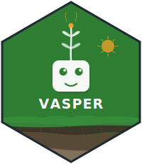

Vasper the friendly VSP reporting tool

## Registered tools (ellmer)

The app registers the following tools in [global.R](global.R):

- `query_tables` — Generic query tables tool
- `get_table_profile` — Deep one-table profile (missingness, distinct counts, sample unique values)
- `get_weather_forecast_open_meteo` — Open-Meteo forecast data (up to 16 days)
- `get_weather_historical_open_meteo` — Open-Meteo historical weather data (including multi-year ranges)
- `get_weather_stations_davis` — Davis WeatherLink station metadata
- `get_weather_current_davis` — Current Davis weather records for a specific `station_uuid`
- `get_weather_historical_davis` — Historical Davis weather records for a specific `station_uuid` and short Unix timestamp window
- `get_weather_stations_wsu` — WSU AgWeatherNet station metadata for the three granted Columbia County, WA stations (Hogeye 100326, Jackson 100328, Alto 100329)
- `get_weather_historical_wsu` — Historical WSU AgWeatherNet records for a specific `station_id` and date range (native 15-minute interval data; aggregate to hourly/daily/monthly via `query_tables` SQL)
- `get_yield_historical_nass` — USDA NASS QuickStats historical Columbia County, WA crop data with paired raw and trend tables

## Acknowledgements

Vasper uses the following data tools and services:

- [{soils} R package](https://wa-department-of-agriculture.github.io/soils/)
- [Open-Meteo API](https://open-meteo.com/)
- [Davis Instruments WeatherLink v2 API](https://weatherlink.github.io/v2-api/)
- [WSU AgWeatherNet Station Data API](https://weather.wsu.edu/)
- [USDA NASS QuickStats API](https://quickstats.nass.usda.gov/api)
- {shiny}, {shinychat}, {ellmer}, {duckdb}, and [R packages listed in manifest.json](manifest.json)

The {soils} package was developed by the Washington State Department of
Agriculture and Washington State University as part of the Washington Soil
Health Initiative.

This product uses the NASS API but is not endorsed or certified by NASS.

AI assistance for this project includes GitHub Copilot, ChatGPT (GPT-5.3-Codex), and Claude (Sonnet 4.6).
